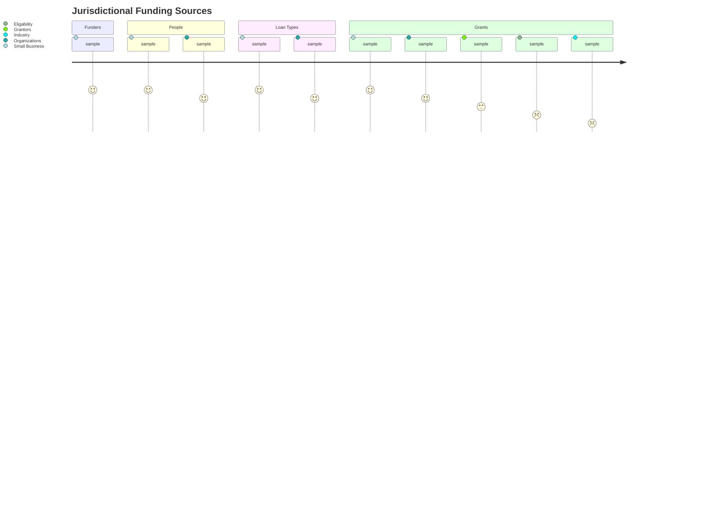

# nocodb-to-gpt-via-api

## Development Instructions

> [!TIP]
> This project utilizes [`uv`](https://docs.astral.sh/uv/) for module management.
> You can find installation instructions via [relevant operating system](https://docs.astral.sh/uv/getting-started/installation/) documentation.

- Clone repository: `gh repo clone aksbdc/nocodb-to-gpt-via-api`
- Source navigation: `cd nocodb-to-gpt-via-api`

### Branch Management

- `main` → production ready environment.
- `staging` → testing changes to be merged into `main`.
- `dev` → testing changes to be merged into `staging`.

## Directory Structure

## Architecture Diagram

## User Stories

#### Scenario Planning

1. [Small Business Owner](https://aksbdc.org/success-stories/)
1. [Expert Advisor](https://aksbdc.org/about/advisors/)
1. [General Public](https://alaska.gov/)

### System Benchmarking

### Experimental Design

### Research Question
